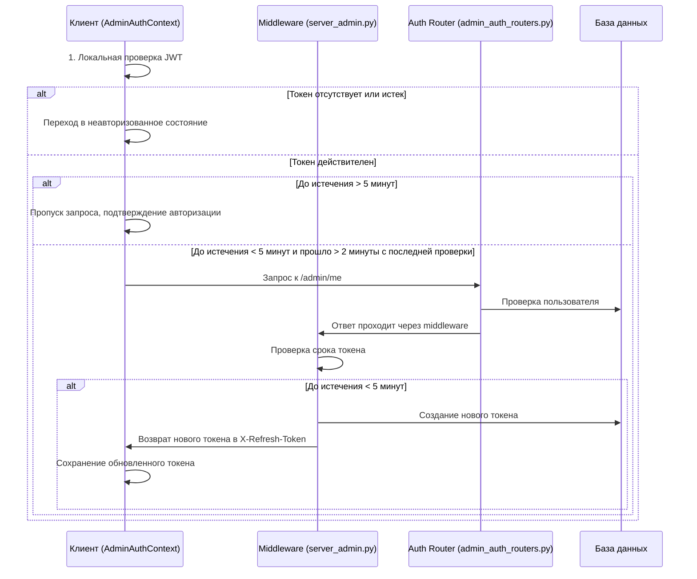

# Рекомендации по управлению авторизацией администратора

## Лучшие практики авторизации и управления токенами

### 1. Многоуровневый подход к проверке авторизации

**Рекомендация**: Используйте многоуровневую стратегию проверки авторизации для оптимизации производительности и UX.

**Реализация**:
- Начинайте с локальной валидации JWT-токена на клиенте
- Проверяйте срок истечения токена без запросов к серверу
- Используйте сетевые запросы только при необходимости (приближение к истечению срока)
- Реализуйте дебаунсинг для предотвращения частых проверок

```typescript
// Пример локальной валидации
const validateTokenLocally = (): boolean => {
  try {
    const token = localStorage.getItem("admin_token");
    if (!token) return false;
    
    const payload = JSON.parse(atob(token.split('.')[1]));
    if (!payload || !payload.exp) return false;
    
    return payload.exp > Math.floor(Date.now() / 1000);
  } catch (e) {
    console.error("Error validating token locally:", e);
    return false;
  }
};
```

### 2. Автоматическое обновление токенов

**Рекомендация**: Внедрите систему автоматического обновления токенов для обеспечения непрерывной сессии пользователя.

**Реализация**:
- Создайте middleware на сервере для проверки токенов
- Обновляйте токены, когда до их истечения остаётся менее 5 минут
- Используйте нестандартный заголовок для передачи обновлённого токена
- Реализуйте обработку заголовка на клиенте

```python
# Пример серверного middleware
@app.middleware("http")
async def refresh_token_middleware(request: Request, call_next):
    response = await call_next(request)
    auth_header = request.headers.get("Authorization")
    if auth_header and auth_header.startswith("Bearer "):
        token = auth_header.split(" ")[1]
        try:
            payload = jwt.decode(token, SECRET_KEY)
            exp = payload.get("exp")
            current_time = datetime.utcnow().timestamp()
            # Обновляем токен, только если осталось менее 5 минут
            if exp - current_time < 300:
                user = await get_current_admin(token, db)
                new_token = await create_access_token(
                    data={"sub": user.email},
                    session=db,
                    expires_delta=timedelta(minutes=ACCESS_TOKEN_EXPIRE_MINUTES)
                )
                response.headers["X-Refresh-Token"] = new_token
        except Exception as e:
            logger.error(f"Error in token refresh middleware: {str(e)}")
    return response
```

### 3. Оптимизация запросов на сервер

**Рекомендация**: Минимизируйте количество запросов к серверу для проверки авторизации.

**Реализация**:
- Определите чёткие критерии, когда необходимо отправлять запрос:
  - Токен приближается к сроку истечения (менее 5 минут)
  - Прошло достаточно времени с последней проверки (более 2 минут)
- Используйте константы для настройки поведения проверки:
  ```typescript
  const SESSION_CHECK_DEBOUNCE_MS = 120000; // 2 минуты
  const TOKEN_EXPIRY_BUFFER = 300; // 5 минут в секундах
  ```
- Отслеживайте время последней проверки, чтобы избежать частых запросов

### 4. Устойчивость к проблемам с сетью

**Рекомендация**: Обеспечьте надёжную работу авторизации даже при нестабильном соединении.

**Реализация**:
- При ошибках сети используйте результаты локальной валидации
- Сохраняйте профиль администратора в localStorage для восстановления после обрыва связи
- Реализуйте механизм повторных попыток с увеличивающимся интервалом
- Предоставляйте понятные сообщения пользователю о состоянии соединения

```typescript
// Пример обработки сетевых ошибок
try {
  const response = await fetch("/admin/me", {
    headers: { Authorization: `Bearer ${token}` }
  });
  // Обработка ответа
} catch (error) {
  // При ошибке сети используем локальную валидацию
  const isLocallyValid = validateTokenLocally();
  if (isLocallyValid) {
    // Продолжаем работу, несмотря на сетевую ошибку
    return true;
  } else {
    // Токен недействителен даже локально
    return false;
  }
}
```

### 5. Интеграция с системой загрузки

**Рекомендация**: Правильно интегрируйте систему авторизации администратора с общей архитектурой загрузки приложения.

**Реализация**:
- AdminAuthContext должен управлять переходами между стадиями загрузки:
  ```typescript
  // После завершения проверки авторизации
  setIsAuthChecked(true);
  setStage(LoadingStage.STATIC_CONTENT);
  ```
- Предотвращайте регрессию к стадии AUTHENTICATION после успешной авторизации
- Используйте bypassLoadingStageCheck для критических запросов в админской панели
- Обеспечьте плавные визуальные переходы между состояниями авторизации

### 6. Безопасная обработка ошибок

**Рекомендация**: Обеспечьте безопасную и понятную обработку ошибок авторизации.

**Реализация**:
- Четко различайте типы ошибок:
  - Истечение срока токена (401)
  - Недостаточные права (403)
  - Сетевые ошибки (не HTTP-статусы)
- При 401/403 всегда очищайте данные сессии:
  ```typescript
  if (response.status === 401 || response.status === 403) {
    localStorage.removeItem("admin_token");
    localStorage.removeItem("admin_data");
    return false;
  }
  ```
- Предоставляйте понятные сообщения об ошибках
- Логируйте ошибки с контекстом, но не включайте чувствительные данные

### 7. Кэширование профиля администратора

**Рекомендация**: Оптимизируйте доступ к данным администратора с помощью кэширования.

**Реализация**:
- Сохраняйте профиль в localStorage при успешной авторизации
- Восстанавливайте данные из localStorage при холодном старте
- Обновляйте кэш при каждом успешном запросе к /admin/me
- Очищайте кэш при выходе из системы или ошибках авторизации

```typescript
// Пример восстановления данных
if (!adminData && isAuthenticated) {
  const storedData = localStorage.getItem("admin_data");
  if (storedData) {
    try {
      setAdminData(JSON.parse(storedData));
    } catch (e) {
      console.error("Error parsing stored admin data");
    }
  }
}
```

### 8. Защита от атак и аномалий

**Рекомендация**: Внедрите механизмы защиты от различных видов атак.

**Реализация**:
- Используйте rate limiting на критических эндпоинтах:
  ```python
  @router.post("/login")
  @rate_limit("login_admin")  # Ограничение: 60 запросов в минуту
  async def login_admin(admin: AdminLogin, ...):
      # Логика авторизации
  ```
- Логируйте все попытки входа, особенно неудачные
- Внедрите защиту от CSRF через правильные заголовки
- Используйте HTTP-only cookies для дополнительной безопасности в production

### 9. Чистая кодовая база

**Рекомендация**: Поддерживайте чистый и понятный код для упрощения обслуживания.

**Реализация**:
- Разделяйте логику авторизации на хорошо именованные функции
- Используйте константы вместо "магических чисел"
- Добавляйте информативные комментарии для сложных участков кода
- Реализуйте систему логирования с разными уровнями важности

### 10. Тестирование авторизации

**Рекомендация**: Тщательно тестируйте все аспекты авторизации администратора.

**Реализация**:
- Создайте модульные тесты для различных сценариев:
  - Токен отсутствует
  - Токен истек
  - Токен почти истек
  - Сетевые ошибки
  - Ответы 401/403
- Тестируйте интеграцию с LoadingContext
- Проверяйте корректное обновление токенов
- Симулируйте нестабильное соединение для проверки отказоустойчивости

## Технические параметры JWT

### Формат токена

Используйте четкую структуру JWT-токена с обязательными полями:
- **sub**: Email администратора (идентификатор)
- **exp**: Время истечения токена в формате UNIX timestamp
- **iat**: Время создания токена (issued at)
- **jti**: Уникальный идентификатор токена для предотвращения повторного использования

### Важные константы

Настраивайте поведение системы через следующие константы:
- **ACCESS_TOKEN_EXPIRE_MINUTES**: 30 минут (время жизни токена)
- **TOKEN_EXPIRY_BUFFER**: 300 секунд (5 минут, буфер для проверки приближения к истечению)
- **SESSION_CHECK_DEBOUNCE_MS**: 120000 мс (2 минуты, минимальный интервал между проверками)
- **ALGORITHM**: HS256 (алгоритм подписи JWT-токена)

## Схема работы системы



## Заключение

Правильная реализация авторизации администратора с умной проверкой и обновлением токенов позволяет:
1. Снизить нагрузку на сервер за счет локальной валидации
2. Обеспечить непрерывную работу администратора без внезапных выходов из системы
3. Повысить устойчивость к проблемам с сетью
4. Улучшить UX с бесшовным обновлением токенов
5. Обеспечить высокий уровень безопасности 