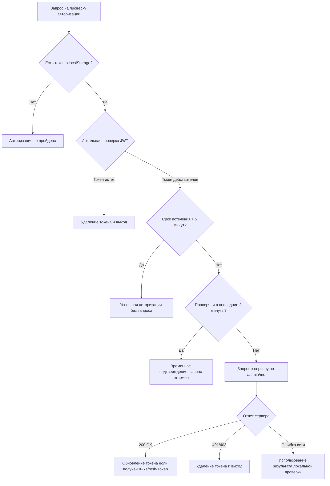

# Управление токенами авторизации в администраторской части

## Общая архитектура

### Компоненты системы авторизации администратора

Система авторизации администратора включает следующие компоненты:

1. **Фронтенд**:
   - `AdminAuthContext` - контекст для управления состоянием авторизации
   - `checkAdminSession` - функция для проверки валидности сессии администратора
   - `validateTokenLocally` - функция для локальной валидации токена

2. **Бэкенд**:
   - `admin_auth_routers.py` - маршрутизация для авторизации администратора
   - `auth.py` - вспомогательные функции для работы с JWT-токенами
   - `server_admin.py` - middleware для обновления токенов

3. **Ключевые константы**:
   - `ACCESS_TOKEN_EXPIRE_MINUTES` - время жизни токена (30 минут)
   - `TOKEN_EXPIRY_BUFFER` - буфер для проверки приближения срока истечения токена (300 секунд = 5 минут)
   - `SESSION_CHECK_DEBOUNCE_MS` - ограничение частоты проверок (120000 мс = 2 минуты)

## Механизм умной проверки авторизации

### 1. Стратегия минимизации серверных запросов

Система реализует многоуровневый подход к проверке авторизации для уменьшения нагрузки на сервер:



### 2. Локальная валидация JWT

Функция `validateTokenLocally` и `isTokenExpiredLocally` проверяют:
- Наличие токена в localStorage
- Декодирование JWT
- Проверку поля `exp` (время истечения) относительно текущего времени

```typescript
// Пример реализации из AdminAuthContext.tsx
const validateTokenLocally = (): boolean => {
  try {
    const token = localStorage.getItem("admin_token");
    if (!token) return false;
    
    const expiry = getTokenExpiration(token);
    if (!expiry) return false;
    
    // Check if token is expired
    const now = Math.floor(Date.now() / 1000);
    return expiry > now;
  } catch (e) {
    console.error("Error validating token locally:", e);
    return false;
  }
};
```

### 3. Оптимизация проверки сессии

Функция `checkAdminSession` использует стратегию:
1. Проверка наличия токена в localStorage
2. Локальная валидация JWT без сетевых запросов
3. Проверка срока истечения токена:
   - Если истек - очистка и выход
   - Если до истечения > TOKEN_EXPIRY_BUFFER (5 минут) - пропуск запроса
   - Если недавно проверяли (в пределах SESSION_CHECK_DEBOUNCE_MS) - пропуск запроса
4. Запрос к серверу только если:
   - Токен приближается к сроку истечения
   - Прошло > 2 минут с последней проверки

## Механизм обновления токенов

### 1. Middleware для автоматического обновления

В `server_admin.py` реализован middleware, который:
1. Проверяет все входящие запросы с токеном
2. Декодирует JWT и проверяет срок истечения
3. Если до истечения осталось < 5 минут, формирует новый токен
4. Возвращает новый токен в заголовке `X-Refresh-Token`

```python
@app.middleware("http")
async def refresh_token_middleware(request: Request, call_next):
    response = await call_next(request)
    auth_header = request.headers.get("Authorization")
    if auth_header and auth_header.startswith("Bearer "):
        token = auth_header.split(" ")[1]
        db = AsyncSessionLocal()
        try:
            payload = jwt.decode(token, SECRET_KEY)
            exp = payload.get("exp")
            current_time = datetime.utcnow().timestamp()
            # Обновляем токен, только если осталось менее 5 минут
            if exp - current_time < 300:  # 300 секунд = 5 минут
                user = await get_current_admin(token, db)
                new_token = await create_access_token(
                    data={"sub": user.email},
                    session=db,
                    expires_delta=timedelta(minutes=ACCESS_TOKEN_EXPIRE_MINUTES)
                )
                response.headers["X-Refresh-Token"] = new_token
        except Exception as e:
            logger.error(f"Error in token refresh middleware: {str(e)}")
        finally:
            await db.close()
    return response
```

### 2. Клиентская часть обработки обновления токенов

Функция `checkAdminSession` на фронтенде проверяет заголовок `X-Refresh-Token` в ответе и обновляет токен:

```typescript
// Проверка обновленного токена в ответе
const refreshToken = response.headers.get("X-Refresh-Token");
if (refreshToken) {
  console.log("checkAdminSession: Received refreshed token from server");
  localStorage.setItem("admin_token", refreshToken);
}
```

## Преимущества системы

1. **Снижение нагрузки на сервер**:
   - Использование локальной валидации JWT без запросов к серверу
   - Дебаунсинг проверок сессии (не чаще раза в 2 минуты)
   - Запрос на обновление токена только при приближении к сроку истечения

2. **Бесшовное обновление токенов**:
   - Автоматическое обновление токенов без прерывания работы пользователя
   - Прозрачное обновление в фоновом режиме через middleware

3. **Надежность при проблемах с сетью**:
   - Использование локальной валидации при недоступности сервера
   - Сохранение сессии при временных проблемах с подключением

4. **Оптимизация UX**:
   - Отсутствие неожиданных выходов из системы
   - Минимизация задержек при проверке авторизации

## Интеграция с LoadingContext

Администраторская часть интегрируется с глобальным `LoadingContext` и следует принципам загрузки системы:

1. `AdminAuthContext` управляет переходом к стадии STATIC_CONTENT после проверки аутентификации
2. Избегает регрессии к AUTHENTICATION после успешной авторизации
3. Предоставляет флаг `isAuthChecked` как единый источник правды о статусе проверки аутентификации

## Ключевые технические аспекты

1. **Формат JWT-токена**:
   - Алгоритм: HS256
   - Включает поля: sub (email пользователя), exp (время истечения)
   - Срок действия: 30 минут (ACCESS_TOKEN_EXPIRE_MINUTES)

2. **Правила обновления токена**:
   - Обновление при оставшемся сроке < 5 минут
   - Новый токен с полным сроком действия (30 минут)
   - Передача через нестандартный заголовок X-Refresh-Token

3. **Защита от атак**:
   - Rate limiting на критических эндпоинтах (/admin/login, /admin/register, /admin/me)
   - Логирование неудачных попыток входа и подозрительной активности
   - Защита от CSRF через заголовки и куки

## Обработка ошибок авторизации

### Типы ошибок и их обработка

1. **Истечение токена**:
   - Локальное удаление токена и данных пользователя
   - Перенаправление на страницу входа
   - Отображение информативного сообщения

2. **Ошибки сети**:
   - Временное использование результатов локальной валидации
   - Повторная попытка при восстановлении соединения
   - Логирование для диагностики проблем

3. **Отказ в доступе (403)**:
   - Очистка данных сессии
   - Перенаправление на страницу входа
   - Журналирование попытки несанкционированного доступа 