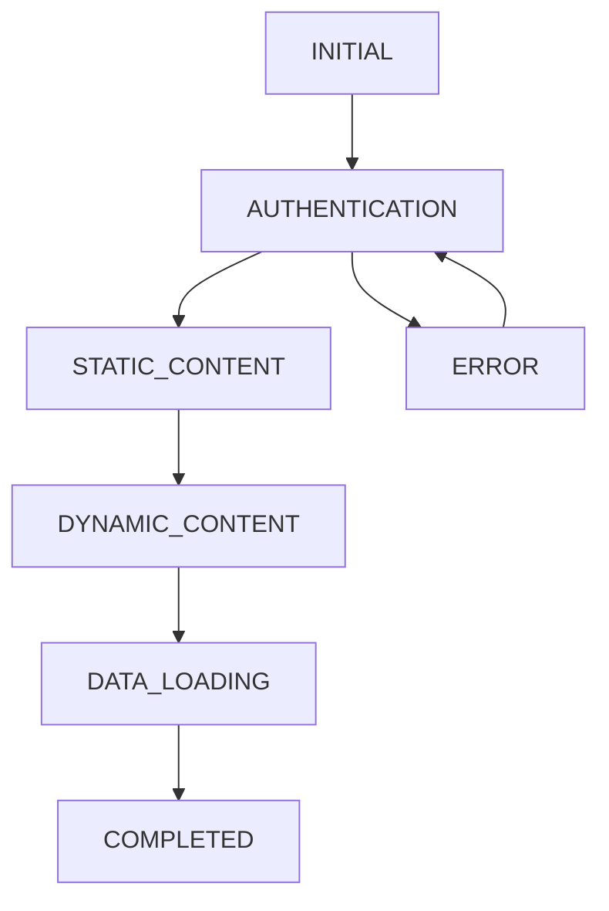

# AI Assistant Guide: Loading System Core Logic

## Core System Architecture

### 1. Loading Stages Flow


**Critical Rules:**
- No regression to AUTHENTICATION after moving to higher stages
- AUTHENTICATION stage only allows auth-related requests and public event data
- STATIC_CONTENT allows public and non-user-specific requests
- DYNAMIC_CONTENT and above allow all requests
- ERROR stage can transition back to AUTHENTICATION
- Stage transitions have automatic timers to prevent getting stuck

### 2. Modular Context Architecture

The loading system has been refactored into multiple specialized contexts:

**LoadingStageContext:**
- Manages the current loading stage (AUTHENTICATION, STATIC_CONTENT, etc.)
- Controls stage transitions with validation
- Maintains stage history to prevent cycles and regressions
- Implements automatic stage progression timeouts

**LoadingFlagsContext:**
- Tracks dynamic and static loading states
- Manages loading flags separately from stages
- Provides flag reset functionality

**LoadingErrorContext:**
- Handles loading-related errors
- Provides error setting and clearing methods
- Manages transition to ERROR stage

**LoadingProgressContext:**
- Tracks loading progress for visual indicators
- Manages progress percentage and completion state

**LoadingContextProvider:**
- Combines all specialized contexts
- Provides a unified interface for backward compatibility
- Detects and fixes loading inconsistencies

### 3. API Request Management

**Key Constants:**
```typescript
const FETCH_TIMEOUT = 15000;        // 15s request timeout
const CACHE_TTL = 60000;           // 60s cache lifetime
const GLOBAL_LOCK_RESET_DELAY = 50; // 50ms global lock reset
const MAX_CONCURRENT_REQUESTS = 15;  // Max concurrent requests
const REQUEST_QUEUE_TIMEOUT = 10000; // 10s queue timeout
const REQUEST_DEDUP_INTERVAL = 50;   // 50ms deduplication window
```

**Request Processing Rules:**
1. Check loading stage compatibility or bypass check if critical
2. Verify cache for GET requests (higher priority in early stages)
3. Check request deduplication within 50ms window
4. Verify global request lock (special handling for critical requests)
5. Process request queue when lock is released
6. Execute request with timeout and AbortController
7. Handle response/error with proper formatting
8. Update cache for successful GET requests
9. Process next requests in queue

### 4. Type-Safe Error Handling

**API Response Types:**
```typescript
export interface ApiErrorResponse {
  error: string;
  status: number;
}

export interface ApiAbortedResponse {
  aborted: boolean;
  reason?: string;
}
```

**Type-Safe Response Handling Pattern:**
```typescript
if ('aborted' in response) {
  const abortedResponse = response as unknown as ApiAbortedResponse;
  // Handle aborted response
  logError("Request aborted", abortedResponse.reason);
  return null;
}

if ('error' in response) {
  const errorResponse = response as unknown as ApiErrorResponse;
  // Handle error response
  logError("Error in response", errorResponse.error);
  return null;
}
```

This pattern ensures type safety when dealing with different response shapes by:
1. Using the `in` operator to check for property presence
2. Casting via `as unknown as TargetType` for maximum safety
3. Handling each response type appropriately

### 5. Centralized Logging System

**Logger Configuration:**
```typescript
// Configure module-specific logging
configureModuleLogging('API', {
  level: process.env.NODE_ENV === 'production' ? LogLevel.WARN : LogLevel.INFO,
  enabled: true,
  persistentContext: { 
    module: 'api',
    version: '1.0.0'
  }
});

// Create loggers with consistent naming
const apiLogger = createLogger('API');
const stageLogger = createLogger('LoadingStageContext');
const errorLogger = createLogger('LoadingErrorContext');
const flagsLogger = createLogger('LoadingFlagsContext');
```

**Logger Features:**
- Module-specific log levels (TRACE, DEBUG, INFO, WARN, ERROR)
- Persistent context for consistent logging
- Structured log formatting
- Rate limiting to prevent log flooding
- Performance metrics tracking
- Conditional logging based on value changes

### 6. Stage Transition Validation

The `canChangeStage` function has been centralized and standardized:

```typescript
export function canChangeStage(
  currentStage: LoadingStage, 
  newStage: LoadingStage, 
  stageHistory: StageHistoryEntry[]
): StageChangeResult {
  // 1. Prevent regression to AUTHENTICATION
  if (newStage === LoadingStage.AUTHENTICATION) {
    const hasBeenPastAuth = stageHistory.some(
      entry => entry.stage !== LoadingStage.AUTHENTICATION && 
              entry.stage !== LoadingStage.INITIAL
    );
    
    if (hasBeenPastAuth) {
      return { 
        allowed: false, 
        reason: 'Regression to AUTHENTICATION after higher stages is not allowed' 
      };
    }
  }
  
  // 2. Check for stage change cycles
  const recentSameStageChanges = stageHistory
    .filter(entry => entry.stage === newStage && 
            Date.now() - entry.timestamp < 2000).length;
  
  if (recentSameStageChanges >= 3) {
    return { 
      allowed: false, 
      reason: 'Too many rapid changes to the same stage, potential cycle detected' 
    };
  }
  
  // 3. Skip if stage hasn't changed
  if (newStage === currentStage) {
    return { 
      allowed: false, 
      reason: 'Stage is already set to this value' 
    };
  }
  
  // Transition allowed
  return { allowed: true };
}
```

This ensures consistent stage transition validation across the codebase.

### 7. API Request Control

**shouldProcessRequest Function:**
```typescript
export function shouldProcessRequest(
  endpoint: string, 
  bypassLoadingStageCheck = false, 
  stage?: LoadingStage
): boolean {
  // If bypass flag is set, skip all loading stage checks
  if (bypassLoadingStageCheck) {
    return true;
  }
  
  // If stage not specified, use the current loading stage
  const currentStage = stage || currentLoadingStage;

  // Always allow specific endpoints regardless of stage
  if (ALLOWED_ENDPOINTS.ALWAYS_ALLOWED.some(
      pattern => endpoint.includes(pattern))) {
    return true;
  }
  
  // Process based on current loading stage
  switch (currentStage) {
    case LoadingStage.AUTHENTICATION:
      // During authentication, only allow auth endpoints
      return endpoint.includes('/auth') || 
             endpoint.includes('/login') || 
             endpoint.includes('/token');
      
    case LoadingStage.STATIC_CONTENT:
      // During static content loading, allow static content endpoints
      return endpoint.includes('/static') ||
             endpoint.includes('/config') ||
             endpoint.includes('/i18n');
      
    case LoadingStage.DATA_LOADING:
    case LoadingStage.COMPLETED:
    case LoadingStage.DYNAMIC_CONTENT:
      // In data loading or completed stages, allow all requests
      return true;
      
    default:
      // Default to blocking in unknown stages
      return false;
  }
}
```

### 8. Performance Optimization Rules

**Request Optimization:**
1. Use cache for GET requests with extended TTL during early stages
2. Deduplicate requests within 50ms window
3. Queue requests when global lock is active
4. Cancel outdated requests with AbortController
5. Rate limit requests per endpoint
6. Bypass loading stage check for critical requests

**State Optimization:**
1. Use useRef for tracking loading state
2. Implement debouncing for state changes (2s minimum)
3. Cache successful responses with adaptive TTL
4. Clear cache on demand or via interval
5. Track request history for deduplication and debugging
6. Use specialized contexts to prevent unnecessary re-renders

### 9. Error Handling Strategy

**API Errors:**
1. Network errors → Return structured error object
2. Timeout errors → Abort request via AbortController
3. JSON parse errors → Format properly for non-JSON responses
4. Stage block errors → Queue request or bypass check
5. Global lock errors → Use cache or queue based on availability

**Loading Errors:**
1. Stage regression → Block transition with warning
2. Auth failures → Stay at current stage, never regress to AUTHENTICATION
3. Timeout errors → Force next stage after 5 seconds
4. Component errors → Show fallback UI
5. Inconsistent loading states → Auto-fix via periodic checks

### 10. Type-Safe API Integration Pattern

When integrating with API responses, follow this pattern for type safety:

```typescript
try {
  const response = await apiFetch<ExpectedType>(url, options);
  
  if ('aborted' in response) {
    const abortedResponse = response as unknown as ApiAbortedResponse;
    handleAbortedRequest(abortedResponse.reason);
    return;
  }
  
  if ('error' in response) {
    const errorResponse = response as unknown as ApiErrorResponse;
    handleErrorResponse(errorResponse.error, errorResponse.status);
    return;
  }
  
  // Process successful response
  processData(response);
} catch (err) {
  // Handle unexpected errors
  handleUnexpectedError(err);
}
```

This pattern ensures proper type checking and error handling for all API interactions.

### 11. Common Pitfalls to Avoid

1. **Stage Regression:**
   - Never allow return to AUTHENTICATION after higher stages
   - Check stage history before transitions
   - Log attempted regressions with context

2. **Request Management:**
   - Always check loading stage or use bypassLoadingStageCheck
   - Handle request cancellation properly with AbortController
   - Set proper timeouts for different request types
   - Use deduplication for frequent requests

3. **State Management:**
   - Use refs for tracking loading state to avoid render issues
   - Implement proper debouncing with at least 2s intervals
   - Clear state on component unmount and abort pending requests
   - Handle loading inconsistencies with detectAndFixLoadingInconsistency

4. **Error Handling:**
   - Always use the type-safe casting pattern (`as unknown as Type`)
   - Provide fallback UI for all loading states
   - Implement proper error boundaries
   - Log errors with context information
   - Handle network failures with extended cache TTL

### 12. Testing Guidelines

**Critical Test Cases:**
1. Stage transition validation, especially regression prevention
2. Request deduplication in high-frequency scenarios
3. Cache invalidation and extended TTL behavior
4. Error handling for various network scenarios
5. Loading state inconsistency detection and fixing
6. Component unmounting with active requests
7. Network failure recovery strategy
8. Stage progression with timeouts

### 13. Maintenance Rules

1. **Code Changes:**
   - Preserve regression prevention logic
   - Maintain request processing order
   - Keep error handling consistent
   - Ensure type safety with proper casting patterns
   - Update documentation for changes

2. **Performance Monitoring:**
   - Track request success rates by stage
   - Monitor stage transition times
   - Log cache hit rates for optimization
   - Track loading inconsistency fixes

3. **Debugging:**
   - Use appropriate log levels (DEBUG, INFO, WARN, ERROR)
   - Monitor stage history for cycle detection
   - Track request queue length and processing
   - Check loading inconsistency fixes in console

This guide reflects the current implementation of the loading system logic. Always refer to this guide when making changes to ensure system stability and consistency. 