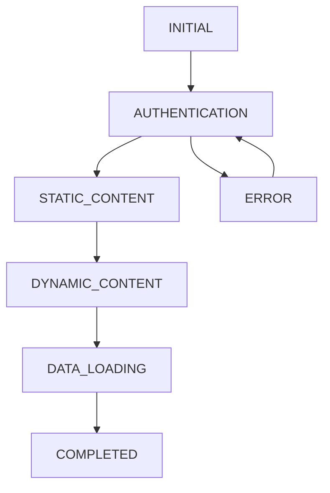

# AI Assistant Guide: Loading System Core Logic

## Core System Architecture

### 1. Loading Stages Flow


**Critical Rules:**
- No regression to AUTHENTICATION after moving to higher stages
- AUTHENTICATION stage only allows auth-related requests and public event data
- STATIC_CONTENT allows public and non-user-specific requests
- DYNAMIC_CONTENT and above allow all requests
- ERROR stage can transition back to AUTHENTICATION
- Stage transitions have automatic timers to prevent getting stuck

### 2. API Request Management

**Key Constants:**
```typescript
const FETCH_TIMEOUT = 15000;        // 15s request timeout
const CACHE_TTL = 60000;           // 60s cache lifetime
const GLOBAL_LOCK_RESET_DELAY = 50; // 50ms global lock reset
const MAX_CONCURRENT_REQUESTS = 15;  // Max concurrent requests
const REQUEST_QUEUE_TIMEOUT = 10000; // 10s queue timeout
const REQUEST_DEDUP_INTERVAL = 50;   // 50ms deduplication window
```

**Request Processing Rules:**
1. Check loading stage compatibility or bypass check if critical
2. Verify cache for GET requests (higher priority in early stages)
3. Check request deduplication within 50ms window
4. Verify global request lock (special handling for critical requests)
5. Process request queue when lock is released
6. Execute request with timeout and AbortController
7. Handle response/error with proper formatting
8. Update cache for successful GET requests
9. Process next requests in queue

### 3. Context Responsibilities

**LoadingContext:**
- Manages loading stages with state history tracking
- Prevents stage regression (especially to AUTHENTICATION)
- Provides logging utilities with different priority levels
- Debounces stage changes and resets
- Tracks stage history to prevent cycles
- Detects and fixes loading state inconsistencies automatically
- Forces transition to next stage after timeouts

**AuthContext:**
- Single source of truth for auth state
- Manages token validation
- Controls transition to STATIC_CONTENT
- Provides login/logout functionality
- Maintains isAuthChecked state
- Dispatches auth-stage-change events

**API Context:**
- Handles request queuing and deduplication
- Manages caching with priority system
- Enforces rate limiting and concurrent request limits
- Provides bypassLoadingStageCheck option for critical requests
- Handles request abortion and timeouts
- Tracks request statistics per loading stage

### 4. Critical Components

**EventsPage:**
```typescript
// Key implementation details
const minFetchInterval = 200; // ms
const skeletonTimeout = 2000; // ms
const initialLoadDelay = 200; // ms

// Critical flags
const hasInitialData = useRef(false);
const isInitialLoad = useRef(true);
```

**Header:**
- Uses AuthContext for auth state
- Implements faster 200ms timeout for state changes
- Provides visual loading indicators
- Manages user session state

### 5. Error Handling Strategy

**API Errors:**
1. Network errors → Return structured error object
2. Timeout errors → Abort request via AbortController
3. JSON parse errors → Format properly for non-JSON responses
4. Stage block errors → Queue request or bypass check
5. Global lock errors → Use cache or queue based on availability

**Loading Errors:**
1. Stage regression → Block transition with warning
2. Auth failures → Stay at current stage, never regress to AUTHENTICATION
3. Timeout errors → Force next stage after 5 seconds
4. Component errors → Show fallback UI
5. Inconsistent loading states → Auto-fix via periodic checks

### 6. Performance Optimization Rules

**Request Optimization:**
1. Use cache for GET requests with extended TTL during early stages
2. Deduplicate requests within 50ms window
3. Queue requests when global lock is active
4. Cancel outdated requests with AbortController
5. Rate limit requests per endpoint
6. Bypass loading stage check for critical requests

**State Optimization:**
1. Use useRef for tracking loading state
2. Implement debouncing for state changes (2s minimum)
3. Cache successful responses with adaptive TTL
4. Clear cache on demand or via interval
5. Track request history for deduplication and debugging

### 7. Critical Implementation Details

**Loading Stage Transitions:**
```typescript
// Automatic progression timeouts
stageTransitionTimerRef.current = setTimeout(() => {
  if (isMounted.current && stage === newStage) {
    console.log('LoadingContext: Auto-progressing stage', { from: stage });
    // Progress to next stage after timeout
    switch (stage) {
      case LoadingStage.AUTHENTICATION:
        setStage(LoadingStage.STATIC_CONTENT);
        break;
      case LoadingStage.STATIC_CONTENT:
        setStage(LoadingStage.DYNAMIC_CONTENT);
        break;
      // ...other stages
    }
  }
}, 5000); // 5 second timeout for auto-progression
```

**Admin Routes Handling:**
```typescript
// Special handling for admin routes
if (isAdminRoute) {
  if (isLoading) {
    // If admin route, immediately set STATIC_CONTENT
    if (stage === LoadingStage.AUTHENTICATION || stage === LoadingStage.INITIAL) {
      setStage(LoadingStage.STATIC_CONTENT);
      
      // Accelerated transition for admin routes - immediately go to COMPLETED
      requestAnimationFrame(() => {
        if (isMounted.current) {
          setStage(LoadingStage.COMPLETED);
          loadingStateRef.current.isStaticLoading = false;
        }
      });
    }
  }
}
```

### 8. Common Pitfalls to Avoid

1. **Stage Regression:**
   - Never allow return to AUTHENTICATION after higher stages
   - Check stage history before transitions
   - Log attempted regressions with context

2. **Request Management:**
   - Always check loading stage or use bypassLoadingStageCheck
   - Handle request cancellation properly with AbortController
   - Set proper timeouts for different request types
   - Use deduplication for frequent requests

3. **State Management:**
   - Use refs for tracking loading state to avoid render issues
   - Implement proper debouncing with at least 2s intervals
   - Clear state on component unmount and abort pending requests
   - Handle loading inconsistencies with detectAndFixLoadingInconsistency

4. **Error Handling:**
   - Provide fallback UI for all loading states
   - Implement proper error boundaries
   - Log errors with context information
   - Handle network failures with extended cache TTL

### 9. Testing Guidelines

**Critical Test Cases:**
1. Stage transition validation, especially regression prevention
2. Request deduplication in high-frequency scenarios
3. Cache invalidation and extended TTL behavior
4. Error handling for various network scenarios
5. Loading state inconsistency detection and fixing
6. Component unmounting with active requests
7. Network failure recovery strategy
8. Stage progression with timeouts

### 10. Maintenance Rules

1. **Code Changes:**
   - Preserve regression prevention logic
   - Maintain request processing order
   - Keep error handling consistent
   - Update documentation for changes

2. **Performance Monitoring:**
   - Track request success rates by stage
   - Monitor stage transition times
   - Log cache hit rates for optimization
   - Track loading inconsistency fixes

3. **Debugging:**
   - Use appropriate log levels (DEBUG, INFO, WARN, ERROR)
   - Monitor stage history for cycle detection
   - Track request queue length and processing
   - Check loading inconsistency fixes in console

This guide reflects the current implementation of the loading system logic. Always refer to this guide when making changes to ensure system stability and consistency. 