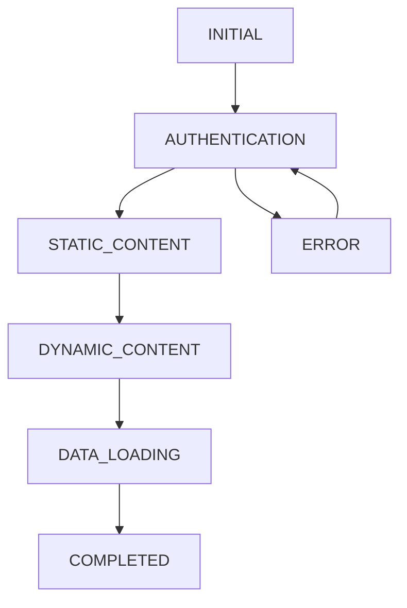

# AI Assistant Guide: Loading System Core Logic

## Core System Architecture

### 1. Loading Stages Flow


**Critical Rules:**
- No regression to AUTHENTICATION after moving to higher stages
- AUTHENTICATION stage only allows auth-related requests
- STATIC_CONTENT allows public and non-user-specific requests
- DYNAMIC_CONTENT and above allow all requests
- ERROR stage can transition back to AUTHENTICATION

### 2. API Request Management

**Key Constants:**
```typescript
const FETCH_TIMEOUT = 15000;        // 15s request timeout
const CACHE_TTL = 60000;           // 60s cache lifetime
const GLOBAL_LOCK_RESET_DELAY = 50; // 50ms global lock reset
const MAX_CONCURRENT_REQUESTS = 15;  // Max concurrent requests
const REQUEST_QUEUE_TIMEOUT = 10000; // 10s queue timeout
const REQUEST_DEDUP_INTERVAL = 50;   // 50ms deduplication window
```

**Request Processing Rules:**
1. Check loading stage compatibility
2. Verify cache for GET requests
3. Check request deduplication
4. Verify global request lock
5. Process request queue
6. Execute request with timeout
7. Handle response/error
8. Update cache for successful GET requests

### 3. Context Responsibilities

**LoadingContext:**
- Manages loading stages
- Prevents stage regression
- Provides logging utilities
- Debounces stage changes (2s)
- Tracks stage history

**AuthContext:**
- Single source of truth for auth state
- Manages token validation
- Controls transition to STATIC_CONTENT
- Provides login/logout functionality
- Maintains isAuthChecked state

**API Context:**
- Handles request queuing
- Manages request deduplication
- Controls caching
- Enforces rate limiting
- Provides bypassLoadingStageCheck option

### 4. Critical Components

**EventsPage:**
```typescript
// Key implementation details
const minFetchInterval = 200; // ms
const skeletonTimeout = 2000; // ms
const initialLoadDelay = 200; // ms

// Critical flags
const hasInitialData = useRef(false);
const isInitialLoad = useRef(true);
```

**Header:**
- Uses AuthContext for auth state
- Implements 200ms timeout for state changes
- Provides visual loading indicators
- Manages user session state

### 5. Error Handling Strategy

**API Errors:**
1. Network errors → Return error object
2. Timeout errors → Abort request
3. JSON parse errors → Return error object
4. Stage block errors → Queue request
5. Global lock errors → Use cache or queue

**Loading Errors:**
1. Stage regression → Block transition
2. Auth failures → Return to AUTHENTICATION
3. Timeout errors → Force next stage
4. Component errors → Show fallback UI

### 6. Performance Optimization Rules

**Request Optimization:**
1. Use cache for GET requests during early stages
2. Deduplicate requests within 50ms window
3. Queue requests when global lock is active
4. Cancel outdated requests with AbortController
5. Rate limit requests per endpoint

**State Optimization:**
1. Use useRef for tracking loading state
2. Implement debouncing for state changes
3. Cache successful responses
4. Clear cache on demand
5. Track request history for deduplication

### 7. Critical Implementation Details

**Loading Stage Transitions:**
```typescript
// Stage transition rules
const stageTransitions = {
  INITIAL: ['AUTHENTICATION'],
  AUTHENTICATION: ['STATIC_CONTENT', 'ERROR'],
  STATIC_CONTENT: ['DYNAMIC_CONTENT', 'ERROR'],
  DYNAMIC_CONTENT: ['DATA_LOADING', 'ERROR'],
  DATA_LOADING: ['COMPLETED', 'ERROR'],
  COMPLETED: ['ERROR'],
  ERROR: ['AUTHENTICATION']
};
```

**Request Processing:**
```typescript
// Request processing order
const requestProcessingSteps = [
  'checkLoadingStage',
  'checkCache',
  'checkDeduplication',
  'checkGlobalLock',
  'processQueue',
  'executeRequest',
  'handleResponse',
  'updateCache'
];
```

### 8. Common Pitfalls to Avoid

1. **Stage Regression:**
   - Never allow return to AUTHENTICATION after higher stages
   - Block stage transitions that violate the flow
   - Log attempted regressions

2. **Request Management:**
   - Always check loading stage before requests
   - Use bypassLoadingStageCheck sparingly
   - Implement proper request cancellation
   - Handle request timeouts

3. **State Management:**
   - Use useRef for loading state tracking
   - Implement proper debouncing
   - Clear state on component unmount
   - Handle race conditions

4. **Error Handling:**
   - Always provide fallback UI
   - Implement proper error boundaries
   - Log errors with context
   - Handle network failures gracefully

### 9. Testing Guidelines

**Critical Test Cases:**
1. Stage transition validation
2. Request deduplication
3. Cache invalidation
4. Error handling
5. Loading state management
6. Component unmounting
7. Network failure recovery
8. State regression prevention

### 10. Maintenance Rules

1. **Code Changes:**
   - Preserve stage transition logic
   - Maintain request processing order
   - Keep error handling consistent
   - Update documentation for changes

2. **Performance Monitoring:**
   - Track request success rates
   - Monitor stage transition times
   - Log cache hit rates
   - Track error frequencies

3. **Debugging:**
   - Use appropriate log levels
   - Track stage transitions
   - Monitor request queues
   - Log error contexts

This guide serves as a reference for maintaining the core loading system logic while assisting with development. Always refer to this guide when making changes to ensure system stability and consistency. 